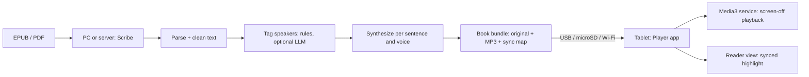

# Architecture v1 (SLC):

Target: Samsung Galaxy Tab E (SM-T560NU), Android 7.1.1, English only.

## 1. Constraint that shapes everything

The Tab E is a low-end 2015 tablet (as far as I know: roughly 1.5 GB RAM, a \~1.3 GHz quad-core, 8 GB storage with a microSD slot; please verify on your unit). Neural TTS such as Kokoro will very likely not run in real time on it, and Android 7.1.1 limits which newer APIs and libraries we can use.

**Decision: v1 does all the AI work on a PC (or server) and the tablet is a light player.** The PC renders a multi-voice MP3 audiobook plus a sync map. The app stores the original EPUB/PDF next to the audiobook, so you can read, listen, or do both together.

## 2. SLC definition for v1

- **Simple:** one flow, EPUB (or PDF) in, audiobook and read-along out. No on-device synthesis, no cloud, no cast-editing UI.
- **Lovable:** distinct character voices, screen-off playback, synced sentence highlight, tap-to-jump, resume, sleep timer, speed control.
- **Complete:** from a fresh book to finishing it on the tablet with no workarounds, no crashes, and no manual file editing beyond one config file.

**v1 is done when:** one full novel (10+ hours) is converted on the PC, copied to the tablet, and read and listened to across several days in all three modes, with the screen off for long stretches, without the app being killed and with correct resume.

## 3. System overview



Two deliverables:

1. **Scribe** (PC Python CLI): book in, bundle out.
2. **Player** (Android app): plays bundles in three modes.

## 4. Book bundle format

```
MyNovel/
  manifest.json        # title, author, type (epub|pdf), chapters[], voices, sync version
  source/book.epub     # the original file, kept as-is (or book.pdf)
  audio/ch001.mp3      # mono, CBR 64 kbps, ~29 MB/hour
  text/ch001.json      # cleaned text plus sync map for the chapter
  cover.jpg
```

`text/ch001.json` (EPUB):

```json
{ "blocks": [
  {"id": 1, "type": "heading", "text": "Chapter One"},
  {"id": 2, "type": "para", "sentences": [
    {"sid": 1, "speaker": "narrator", "start_ms": 0,    "end_ms": 4200, "text": "..."},
    {"sid": 2, "speaker": "Ana",      "start_ms": 4200, "end_ms": 6100, "text": "..."} ]} ] }
```

PDF books use page-level sync instead: `"pages": [{"page": 1, "start_ms": 0}, {"page": 2, "start_ms": 93000}, ...]`.

Notes:

- **Exact sync without alignment tools:** Scribe synthesizes sentence by sentence, so it knows each sentence's duration. Timings come from the audio it generates, not from guessing.
- **Accurate timestamps:** build each chapter's MP3 from one continuous audio buffer, and encode as constant bitrate (CBR). Variable bitrate makes seeking and timestamps drift.
- **Size:** a 15-hour novel is about 430 MB; keep bundles on the microSD card.
- **Fallback:** if a device has trouble, other formats (AAC/M4A) are a Scribe flag away.

## 5. Player modes

| Mode | Behavior |
| --- | --- |
| Read only | Scrollable text, no audio; position saved |
| Listen only | Audio plays with the screen off; lock screen and Bluetooth controls |
| Read + listen | Current sentence highlighted and auto-scrolled; tap any sentence to jump the audio there; scrolling manually pauses auto-follow, and a "back to now" button re-syncs |

All three modes share one saved position (chapter and millisecond), so you can switch between them at any point.

**Display choice for v1:** the reader view renders Scribe's cleaned text (headings, paragraphs, italics), not the raw EPUB. This gives exact sentence sync and stays light on 1.5 GB RAM. The original EPUB/PDF is still stored in the bundle. True EPUB rendering with the original layout is a later upgrade.

**PDF in v1:** convert PDFs to clean text on the PC so they follow the EPUB reader path (sentence sync plus `pages` marks for lookup). The rendered page image (`PdfRenderer`) is a v1.1 option (D-046), not built. Word-level highlighting inside PDFs is out of scope.

## 6. Scribe (PC or server)

| Stage | Tool |
| --- | --- |
| EPUB parse | `ebooklib` + `BeautifulSoup` |
| PDF text extraction | PyMuPDF (AGPL, fine because Scribe is AGPL-3.0-or-later and never ships in the Player) |
| Sentence split | `pysbd` or spaCy |
| Dialogue detect | regex over quotes (straight and curly, multi-paragraph) |
| Speaker attribution | rules first ("said X", nearest name, two-person alternation); optional local LLM via Ollama for ambiguous lines (v1.1) |
| Voice config | `cast.yaml` (character to voice, pitch/speed offsets), auto-drafted then hand-editable |
| TTS | Kokoro (many voices in one model) or Piper multi-speaker models |
| Assemble/encode | `ffmpeg`, timings from per-sentence audio lengths |
| CLI | `typer`; `scribe draft book.epub`, edit `cast.yaml`, `scribe build book.epub` (both accept EPUB or PDF; flags in `05-ScribeDesign.md` section 1) |

Keep one command with a review step: Scribe writes a draft `cast.yaml` first, you edit voices, then it renders. A PC is enough for v1; a server only matters if others should convert books without running Scribe themselves.

## 7. Player (Android)

| Concern | Choice |
| --- | --- |
| Language/UI | Kotlin, Jetpack Compose (works on API 21+); `minSdk 24` |
| Playback | Media3 ExoPlayer inside a `MediaSessionService` (foreground service) |
| Screen-off | Foreground notification + ExoPlayer `setWakeMode` |
| Controls | Media3 session gives lock screen, notification and Bluetooth buttons |
| Speed | `PlaybackParameters` (0.75x to 2.0x) |
| Library/progress | Room (books, chapter, position in ms) |
| Import | Watch folders via the system folder picker (SAF persistable grants); auto-created default is shared internal `/Auloud` |
| Reader view | Compose `LazyColumn` of blocks and sentences, synced to player position via a position ticker (about every 200 ms) |
| PDF pages | v1.1 option only (`PdfRenderer`), not built; v1 reads PDF text with `pages` marks |
| Images | Coil (cover art) |

Design rules for 1.5 GB RAM: stream audio, load one chapter's JSON at a time, no large bitmap caches.

Android 7.1.1 specifics:

- No notification channels needed (that's API 26+).
- A foreground playing service is exempt from Doze while playing.
- Samsung's battery optimizer can still kill apps, so add a first-run prompt to whitelist the app.
- Save position every few seconds and on pause or destroy.

## 8. Repo layout

```
audiobook/
  scribe/            # Python: cli, parse, tag, tts, encode, bundle
  player/            # Android project (app, data, playback, ui)
  spec/bundle.md     # the bundle format contract
```

Write the bundle spec first; it is the contract between the two halves.

## 9. Build slices (each one shippable to your tablet)

1. **Slice 1, Player shell:** import a hand-made bundle, play chapters, screen-off playback works.
2. **Slice 2, Scribe single voice:** EPUB to full bundle with one narrator voice and a sync map, end to end.
3. **Slice 3, Read-along:** reader view, highlight, tap-to-jump, the three modes, resume.
4. **Slice 4, Multi-voice:** dialogue detection, cast.yaml, character voices.
5. **Slice 5, Complete pass:** PDF page sync, battery-whitelist prompt, error handling, sleep timer, chapter navigation, and a full-novel soak test.

The bundle format stays fixed across slices, so the two sides can be built independently.

## 10. Risks

- **Samsung killing the service:** whitelist prompt, foreground service, soak test.
- **Sync drift:** CBR encoding, one buffer per chapter, and a test that compares highlight against audio at several points.
- **Speaker attribution errors:** limit v1 to narrator plus the top 3-5 characters with a hand-editable cast file.
- **PDF messiness:** headers, page numbers, hyphenation; prefer EPUB, and clean PDFs on the PC.
- **Large storage use:** keep bundles on the microSD card; a 15-hour novel is around 430 MB.

## 11. License (recommendation)

Player under **Apache-2.0** (or MIT). Scribe under **AGPL-3.0-or-later**, because ebooklib is AGPL and PyMuPDF is AGPL (Scribe-only, never in the Player). The tablet only plays audio, so no GPL code ships in the app. Verify each model's license; this isn't legal advice.

## 12. Notes for later versions

- **v2:** embed the EPUB/PDF in the app so the device runs its own TTS (Kokoro or Piper), generating audio on the device instead of needing a PC-rendered MP3.
- **v3:** support later Android versions.