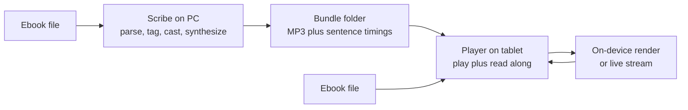

# What Auloud is and why it looks like this

Auloud turns ebooks into multi-voice audiobooks. A PC program (**Scribe**, Python) renders the audio; an Android app (**Player**, Kotlin) plays it on an old tablet with read-along text. Since v2 the tablet also renders its own audio on-device and streams unrendered chapters live.

The shape comes from one constraint: the reference device is a 2015 Samsung Galaxy Tab E (Android 7.1.1, about 1.5 GB RAM, no network in the app). Everything expensive happens where there is CPU to spare. Everything on the tablet is budgeted for a slow CPU and a small heap.

Two paths, one contract:

- **PC path (best quality).** Scribe assigns every line to a character voice, synthesizes with Kokoro or Piper, and writes MP3s plus millisecond sentence timings. The tablet plays them back and highlights each sentence as it sounds.
- **On-device path (no PC).** The tablet imports the EPUB itself, renders chapters in the background with installed voices, and plays them. Unrendered chapters stream live through system TTS so listening starts in seconds.

Both paths meet at the bundle: a folder of `manifest.json`, per-chapter MP3s, and per-chapter sentence JSON. Scribe writes it, the Player reads it, and the spec both obey lives in `docs/03-BundleSpec.md`. That split is the whole architecture. Continue with `02-repo-tour.md` for the layout, or `07-why-this-architecture.md` for the reasoning.
