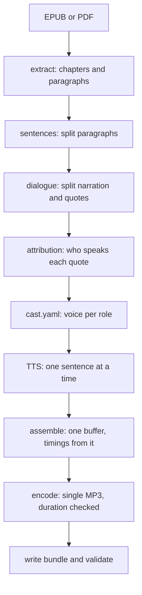

# How Scribe turns an EPUB into a bundle

Two commands do the work. `scribe draft` parses and tags the book and drafts the cast; `scribe build` synthesizes the audio and writes the bundle. `scribe/draft.py:run_draft()` and `scribe/build.py:run_build()` orchestrate; `scribe/cli.py` only parses arguments.

## Extract (`scribe/extract/`)

`epub.py` walks the spine in order with `ebooklib` plus BeautifulSoup: headings, paragraphs, blockquotes, and breaks become blocks, with italic/bold span offsets tracked. `clean.py` drops navigation, boilerplate (copyright, ISBN, Gutenberg headers), and empty pages, merges tiny chapters, and normalizes text to NFC. `pdf.py` does the same from PyMuPDF text blocks, with two-column ordering, hyphen joining, and header/footer detection. Scanned PDFs (no text layer) fail with a clear message. Every drop is logged, never silent.

## Sentences (`scribe/text/sentences.py`)

`pysbd` proposes sentence boundaries, then post-fixes glue back what it splits wrongly: title abbreviations (`Mr.`, `Dr.`), single-capital initials, and ellipses. Only straight and curly double-quote pairs count as quote boundaries; apostrophes never split. The join of the sentences always equals the paragraph exactly, so no text is lost or duplicated.

## Dialogue (`scribe/text/dialogue.py`)

Each sentence splits at quote boundaries into narration and dialogue halves. Multi-paragraph quotes carry over: a paragraph that opens a quote and never closes it marks the following paragraphs as continued dialogue. Unbalanced strays are logged and treated as narration. Scare quotes (short quoted fragments with no sentence punctuation, like "hideous") stay narration. Halves of one original sentence keep a `split_pair` link so the renderer leaves a 100 ms tag pause between them.

## Attribution (`scribe/text/attribution.py`, `scribe/text/speakers.py`)

Rule-based, in strict priority order (full detail in `04-voices-and-gender.md`): explicit speech tag, pronoun tag, alternation in dialogue-only blocks, continuation, fallback to the previous speaker or `unknown`. Each quote gets a confidence; `cast_report.md` lists every low-confidence line with context plus a paste-ready override snippet.

## Cast (`scribe/text/cast.py`, `cast.yaml`)

The draft writes a cast with a narrator voice, one voice per top character, `default_female` and `default_male` generic voices, name aliases, and the quote overrides. You fix mistakes by editing `cast.yaml` and rebuilding; the audio cache keys on (text, voice, speed, pitch, engine version), so only changed lines re-render.

## Synth, assemble, encode (`scribe/tts/`, `scribe/audio/`)

Each engine implements `TTSEngine.synth(text, voice, speed)` returning mono audio at 24 kHz. Kokoro is native 24 kHz; Piper resamples. The assembler concatenates one sentence at a time into one continuous buffer with fixed pauses (250 ms sentence, 500 paragraph, 800 heading, 1000 break, 100 tag), records each sentence offset from that same buffer, then encodes once to CBR mono 64 kbps MP3. Timings can never drift from the audio because they come from the same buffer. `ffprobe` must confirm the MP3 duration within 50 ms or the build fails.
