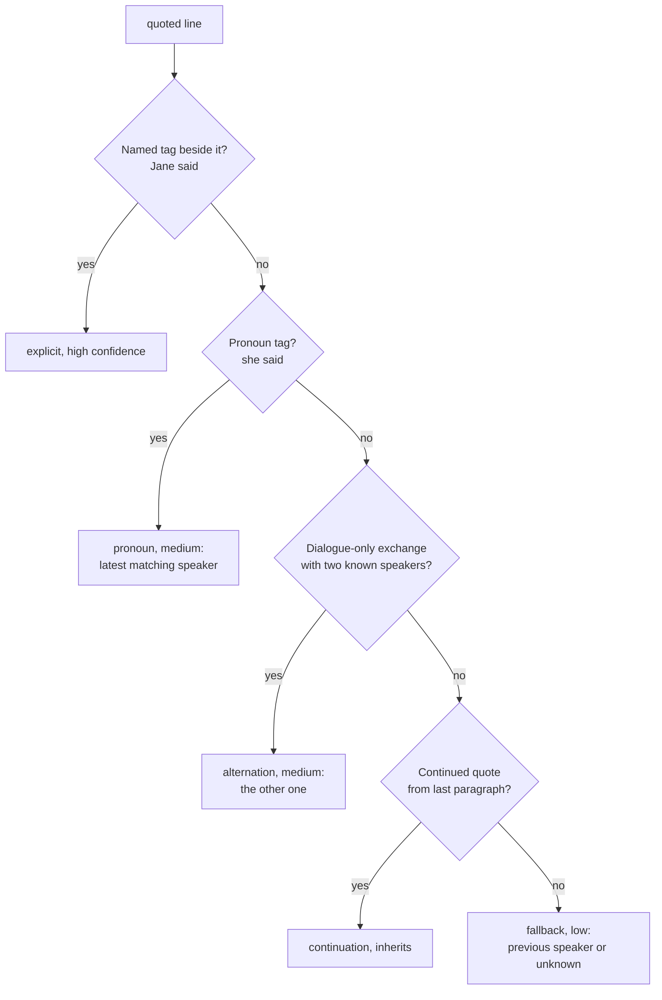

# Voices, speakers, and what gender means

Three separate jobs share the word "voice": finding dialogue, deciding who speaks it, and picking the sound. Mixing them up is the fastest way to misunderstand this codebase.

## Finding dialogue

`scribe/text/dialogue.py` splits sentences at quote boundaries (see `03-scribe-pipeline.md`). Output is narration versus dialogue halves with quote numbers. No speaker involved yet.

## Deciding the speaker

`scribe/text/attribution.py:attribute_quotes()` applies five rules in order. The first rule that fires wins:

Candidates come from `scribe/text/speakers.py`: speech verbs, `PERSON` entities, titled names, clustered aliases. Confidence lands in the bundle JSON, and `cast_report.md` lists low-confidence lines for a human to fix with overrides. Accuracy on 107 hand-checked lines is 92.5%; the misses are lines no speaker can take (interior thought, unattributed shouts), which render in a generic voice.

## What gender means here

Gender is a voice-picking hint, not a detected fact. `gender_hint_for()` votes from pronoun surfaces, tiny first-name lists, and nearby pronouns, else `unknown`. It does two small jobs: it steers which palette voice a new character gets in the draft, and it picks the generic fallback (`default_male` versus `default_female`). Nobody claims the book's characters are labeled correctly; the hint only has to sound right.

## Voice resolution at build time

`scribe/text/cast.py:resolve_speaker()` maps each sentence to a voice in order: quote-key override, text-regex override, first-person target, exact narrator/character/alias match, then the gender generic. `scribe/build.py` collapses the result to the manifest `voices` map (narrator, used characters, the two generics).

## The device has two voices

On the tablet there is no per-character audio: one narrator voice plus one dialogue voice (`tts/BookVoices.kt`). Re-rendering a Scribe book on-device collapses every character into the dialogue voice. Switching engines re-renders only stale chapters, detected by the render fingerprint (engine, voices, speeds, versions). This is deliberate scope control: per-character voices on a 1.5 GB tablet was cut in v2 planning, and the PC stays the multi-voice path.
