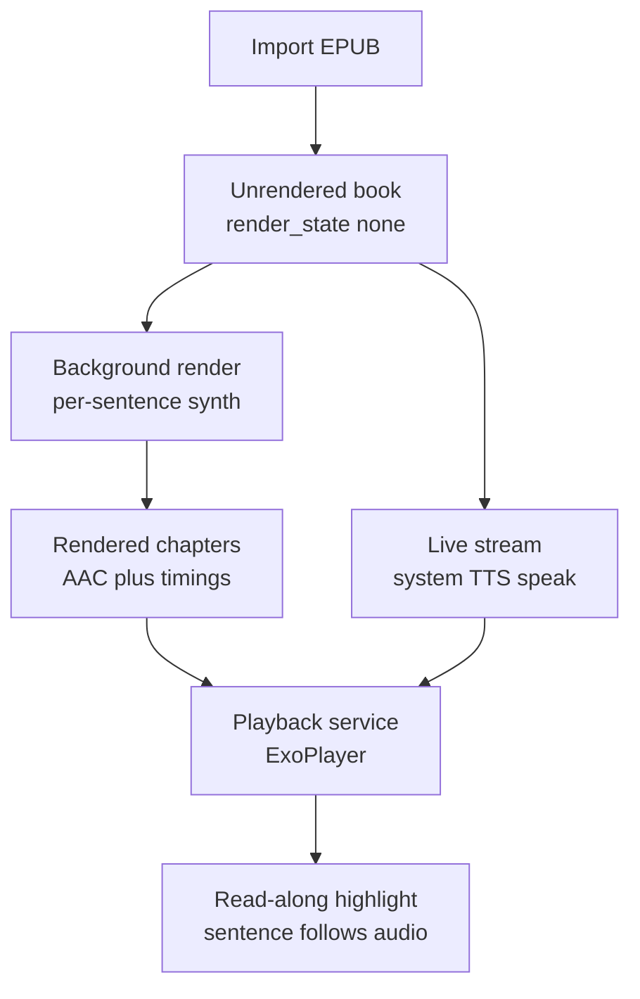

# How the Player works

The Player imports books, renders their audio, and plays them back, all offline on a weak tablet. Three pipelines share one library and one position store.

## Import (`player/.../ingest/`)

`IngestPipeline.importEpub()` is a Kotlin port of the Scribe text stages: container read, structure walk and clean, sentence split, dialogue tag. Output is a spec 2.0 unrendered book: chapter text JSON, the source EPUB, placeholder voices, `render_state: none`. A `BundleValidator` self-check runs before the book lands in the library, so a bad import never corrupts the shelf.

## Render (`player/.../render/`)

`RenderService` is a foreground service with a wake lock: per-sentence synth through the `TtsEngine` seam, resume that skips finished sentences, loudness leveling across voices, assembly with the same pause rules as Scribe, then AAC encode plus timing JSON. Kill the app mid-render and it resumes without redoing finished sentences. Changing voices marks chapters stale by fingerprint; re-render covers only what changed. Guards pause rendering on heat, low storage, or a competing stream.

## Play (`player/.../playback/`)

`PlaybackService` (a Media3 session service) plays rendered chapters through ExoPlayer with one saved position per book, speed, sleep timer, and 5-second progress saves. Unrendered chapters stream live instead: `StreamPlayer` speaks sentences through system TTS a few ahead of the highlight, with per-utterance leveling and sentence-id positions. The router picks rendered audio when present and falls back to the stream; streaming pauses any render job it started itself.

## Voices (`player/.../tts/`)

One `TtsEngine` interface, three implementations: System TTS everywhere, Piper via sherpa-onnx in the `full` flavor only, plus a debug beep engine. Voice ids carry their engine (`system:`, `piper:`), and the registry routes on the prefix. Packs are folders you copy into `/Auloud/models/`; the app never downloads anything, because it holds no `INTERNET` permission.

## The constraints you feel in the code

- One chapter's JSON in memory at a time. Audio streams; MP3s are never read whole.
- `minSdk 24` guards around anything newer; no `java.time` without desugaring; no notification channels.
- All file access goes through `BundleStorage`, so a future storage backend changes one layer.
- Two flavors from one codebase: `core` ships zero GPL bytes, `full` carries its notices and source offer. `licenseScan` and `releaseManifestCheck` prove it on every build.
